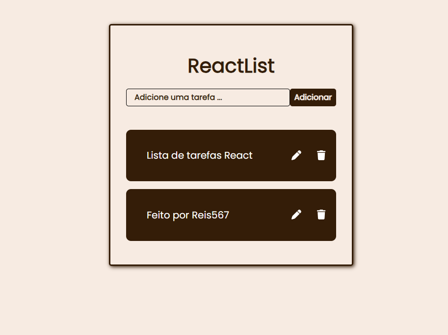

# Lista de Tarefas em React

Bem-vindo à minha aplicação de lista de tarefas construída com React. Neste projeto, você pode criar, editar, marcar como concluídas e excluir tarefas. A aplicação oferece uma experiência simples e funcional para gerenciar suas tarefas diárias.



A aplicação está implantada em [https://todoreactreis.netlify.app/](https://todoreactreis.netlify.app/).

## Funcionalidades

- Adicionar novas tarefas.
- Marcar tarefas como concluídas.
- Editar tarefas existentes.
- Excluir tarefas.
- Design responsivo para dispositivos móveis.

## Tecnologias Utilizadas

- React
- JavaScript
- HTML
- CSS
- [Font Awesome](https://fontawesome.com/) para ícones.

## Como Usar

1. Clone o repositório:

```bash
git clone https://github.com/seu-usuario/nome-do-repositorio.git
```

2. Navegue até o diretório do projeto:

```bash
cd nome-do-repositorio
```

3. Instale as dependências:

```bash
npm install
```

4. Inicie a aplicação:

```bash
npm run dev
```

A aplicação será executada localmente em `http://localhost:5173`.

## Como Contribuir

Contribuições são bem-vindas! Se você deseja melhorar este projeto, siga estas etapas:

1. Faça um fork do repositório.
2. Crie uma branch para sua contribuição:

```bash
git checkout -b sua-feature
```

3. Faça suas alterações e adicione testes, se aplicável.
4. Confirme suas alterações:

```bash
git commit -m 'Adicionei uma nova funcionalidade'
```

5. Envie suas alterações para o seu fork:

```bash
git push origin sua-feature
```

6. Crie um pull request para este repositório.
